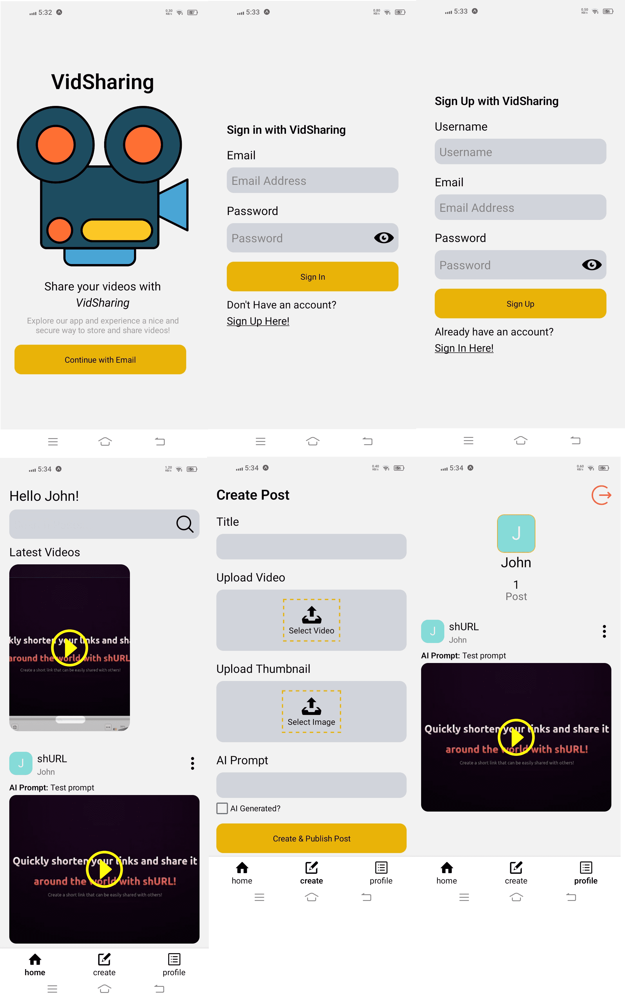

# react-native-video-sharing-app
A Simple and responsive video sharing app created using react native for mobile.

# Technologies Used
* **Appwrite**
* **React Native**
* **NativeWind**
* **Expo**
* **javascript**

# Testing this project
Before you can test this project, you need to create `appwriteConfig.js` in `app/lib` directory, 
create an object and name it `appwriteConfig`, make sure that the object is exportable and then 
add these attributes.

**endpoint** -> `https://cloud.appwrite.io/v1`  
**platform** -> name of the package of your project e.g. `com.myorg.vidsharing`  
**projectId** -> can be found in the project dashboard next to your project name. 
**databaseId** -> can be found in the 'databases' section.  
**userCollectionId** -> in your database, create a collection and name it 'users'. Once created,
you can now acquire the ID of the collection. 
**videoCollectionId** -> in your database, create a collection and name it 'videos'. Once created,
you can now acquire the ID of the collection.   
**storageId** -> can be found in the 'Storage' section. 

